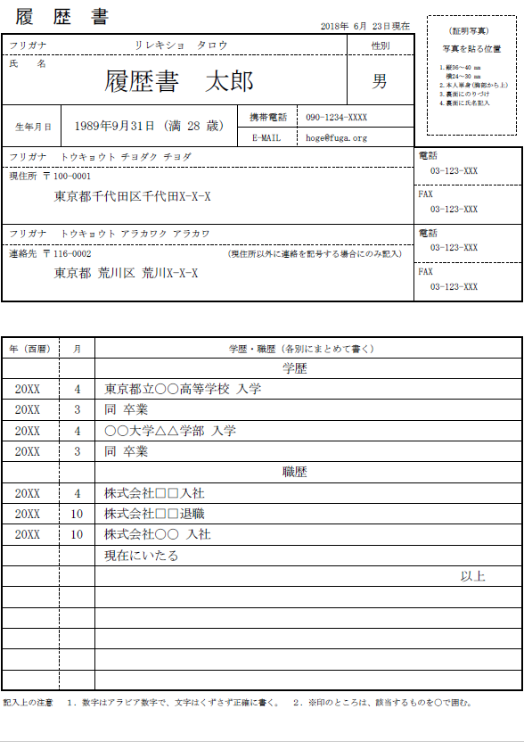
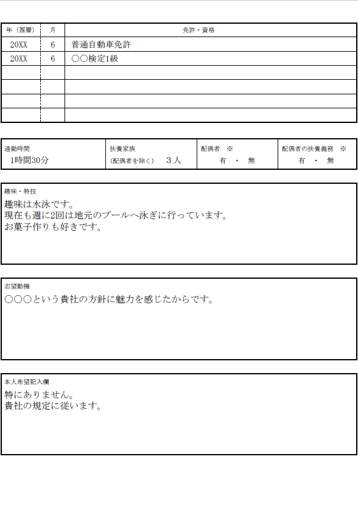

YAMLによる履歴書作成スクリプト Python
===

[](LICENSE)

このスクリプトは、[kaityo256](https://github.com/kaityo256)さんの
[yaml_cv](https://github.com/kaityo256/yaml_cv)をPython言語に移植したものです。

本スクリプトも、基本的に[yaml_cv](https://github.com/kaityo256/yaml_cv)と同様の仕様になるよう作成したつもりです。  


## 必要なライブラリ等
* [PyYAML](http://pyyaml.org/)
* [reportlab](http://www.reportlab.com/)

Windows10_Python3.6.5にて動作確認しました。  

## 使い方

> 以下のように、`-i`に続けてデータファイル、`-s`に続けてスタイルファイル、`-o`に続けて出力ファイルを指定します。  
省略した場合のデフォルトはそれぞれ`data.yaml`、`style.yaml`、`output.pdf`です。  

```
$ python make_cv.py -h
usage: make_cv.py [-h] [-i INPUT] [-s STYLE] [-o OUTPUT]

optional arguments:
  -h, --help  show this help message and exit
  -i INPUT    set input file path. e.g. hoge.yaml
  -s STYLE    set style file path. e.g. hoge.yaml or hoge.txt
  -o OUTPUT   set output file path. e.g. hoge.pdf
```

>YAML形式のデータファイル(例:data.yaml)とスタイルファイル(例:style.txt)を用意し、スクリプトを以下のように実行します。

```
$ python make_cv.py -i data.yaml -s style.txt -o output.pdf
```

出力結果





### 最後に
本スクリプトの公開をご快諾下さりました[kaityo256](https://github.com/kaityo256)さんには、この場を借りてお礼申し上げます。
